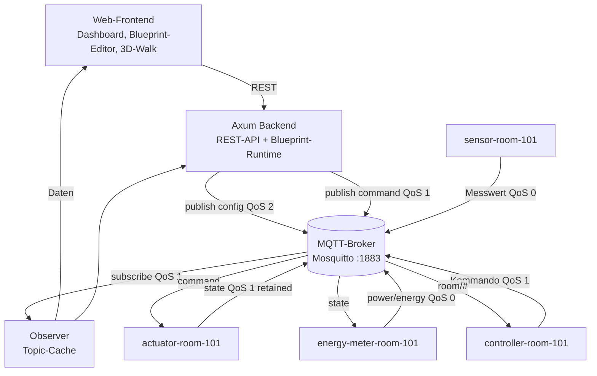
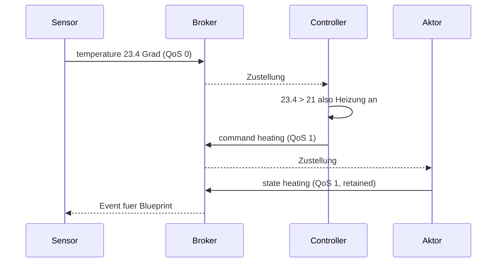

# MQTT Gebäudesteuerung — Dokumentation

Gebäude mit Räumen, Sensoren und Aktoren. Alles läuft über MQTT, keine Hardware.

---

## Architektur



Komponenten pro Raum: **Sensor**, **Aktor**, **Controller**, **Energiemeter** — je ein eigener MQTT-Client mit eigener Client-ID.

## Regelvorgang



---

## Topics

```
building/{id}/floor/{f}/room/{r}/sensor/{typ}
building/{id}/floor/{f}/room/{r}/actuator/{a}/command
building/{id}/floor/{f}/room/{r}/actuator/{a}/state
building/{id}/floor/{f}/room/{r}/config
building/{id}/floor/{f}/room/{r}/event
building/{id}/device/{client_id}/availability
```

Regeln: feste Segmentreihenfolge, IDs als Slugs (`room-101`), Trennung von
`command` und `state` (verhindert Rückschleifen), Wildcards nur mit `+` für
Geräteebene und `#` für Raum-/Gebäudebene. Alle Topics werden in `src/topics.rs`
gebaut.

| Topic | Richtung | QoS | Retained |
|---|---|---|---|
| `.../sensor/temperatur,feuchte,co2,occupancy,motion,light` | Sim → Broker | 0 | nein |
| `.../sensor/energy` | Sim → Broker | 0 | nein |
| `.../actuator/{a}/command` | Regler → Gerät | 1 | nein |
| `.../actuator/{a}/state` | Gerät → Broker | 1 | **ja** |
| `.../config` | Dashboard → Raum | 2 | nein |
| `.../event` | Regler → Broker | 1 | nein |
| `building/main/device/{id}/availability` | alle → Broker | 1 | **ja** |

Abos: Dashboard `building/main/#`, Controller `room/{f}/{r}/#`,
Aktor `.../actuator/+/command`, Energiemeter `.../actuator/+/state`.

---

## Payload

Ein Format für alle Topics (`MqttMessage` in `main.rs`):

```json
{
  "timestamp": "2026-09-23T14:05:11.482Z",
  "device_id": "sensor-room-101",
  "room_id": "room-101",
  "message_type": "measurement",
  "value": { "temperature_c": 23.4 },
  "metadata": { "simulation": true, "sequence": 412 }
}
```

`message_type`: `measurement | command | state | event | config | availability`.
`correlation_id` verknüpft Kommando und Zustand, `sequence` zeigt Lücken in der
Telemetrie.

---

## QoS

| Level | Wo | Warum |
|---|---|---|
| 0 | Sensoren, Energiemeter | Hochfrequent, verlorene Messung ist egal. Spart Round-Trips. |
| 1 | Kommandos, Zustände, Events | Heizung darf nicht ausfallen. Kommandos sind idempotent (Sollzustand), Doppelung harmlos. |
| 2 | `config` | Muss genau einmal wirken, sonst doppelter Regelvorgang. Selten, deshalb vertretbar. |

Code: QoS 0 `publish_measurement`, QoS 1 `publish_command`/`publish_state`, QoS 2 `update_room_config`.

## Retained Messages

Anwendungsfall: **letzter Aktorzustand**. `.../actuator/{a}/state` wird mit
`retain = true` gesendet. Ein neu startender Subscriber sieht sofort, ob z. B.
das Licht noch an ist, ohne auf den nächsten Regelzyklus zu warten. Gleiches
gilt für `availability`.

Wird ein Raum gelöscht, räumt `forget_room_topics()` die Topics auf. Alte
Retained-Nachrichten löscht `purge_legacy_retained()` per Publish mit leerem
Payload, sonst kämen sie bei jedem Broker-Neustart zurück.

Kommandos und Messwerte sind bewusst **nicht** retained: ein altes „Tür
auf" würde nach Neustart erneut ausgeführt.

## Last Will and Testament

Jeder Client registriert ein Will-Message auf
`building/main/device/{id}/availability` (QoS 1, retained) mit
`status: offline`, `reason: unexpected_disconnect`. Keep-Alive 10 s.

1. Client stirbt ohne `DISCONNECT` (Kill, Netzwerk, Rechner aus)
2. Broker wartet 1,5 × 10 s = **15 s**
3. Broker veröffentlicht das Will-Message retained
4. Dashboard zeigt den Raum als offline

Bei sauberem Shutdown kommt `DISCONNECT`, das Will-Message feuert nicht.
Verbindet sich ein Client, überschreibt sein `online`-Retained den alten Wert.

## Visualisierung

Gebäudebaum, Raumkacheln (Temperatur, CO₂, Anwesenheit, Licht), Energie pro
Raum und als Summe, Aktor-Lampen, Live-Topic-Monitor mit QoS-Anzeige, Event-Log,
Blueprint-Editor (Nodes + Edges), 3D-Walk (WASD, E zum Bedienen).

Das Dashboard liest nur aus dem MQTT-Cache, nie aus dem internen Zustand.

---

## Ablauf in 5 Einheiten

### 1 — Grundgerüst
- Projekt aufgesetzt, Mosquitto via Docker
- Topic-Hierarchie und Namenskonvention festgelegt
- `MqttMessage`-JSON mit Zeitstempel definiert
- `topics.rs` als einzige Topic-Quelle

### 2 — Simulation und QoS
- Gebäudemodell, Topics automatisch aus dem Baum erzeugt
- Vier Clients pro Raum (Sensor, Aktor, Controller, Energiemeter)
- QoS 0 / 1 / 2 verteilt
- Sensorik, Garagentor-Animation, kWh-Integration

### 3 — Regelwerk, Retained, LWT
- Temperatur-, CO₂- und Lichtregelung je Raum
- Blueprint-Runtime: Trigger → Bedingung → Aktion
- Retained Zustände, Retained-Aufräumen
- LWT und Keep-Alive, Stale-Prüfung

### 4 — Visualisierung
- Gebäudebaum, Raumkacheln, Energieansicht
- Live-Topic-Monitor, Event-Log
- Blueprint-Editor
- 3D-Ansicht und 3D-Walk
- Architekturdiagramm

### 5 — Abnahme
- QoS 0/1/2, Retained nach Neustart, LWT nach Abbruch nachgewiesen
- Topic-Konzept und Payload dokumentiert
- Bugfixes: 3D-Kamera, Blueprint-Node-Positionierung
- Präsentation vorbereitet

---

## Dateien

| Datei | Inhalt |
|---|---|
| `src/main.rs` | Bootstrap, AppState, Clients, Observer, REST |
| `src/topics.rs` | Topic-Builder |
| `src/blueprints.rs` | Gebäudemodell, Devices, Store |
| `src/blueprint_runtime.rs` | Regel-Auswertung |
| `src/simulators.rs` | Sensor-, Aktor-, Controller-, Energiemeter-Clients |
| `src/building_api.rs` | REST-API Gebäude/Räume/Geräte |
| `web/index.html` | Dashboard, Editor, 3D-Walk |